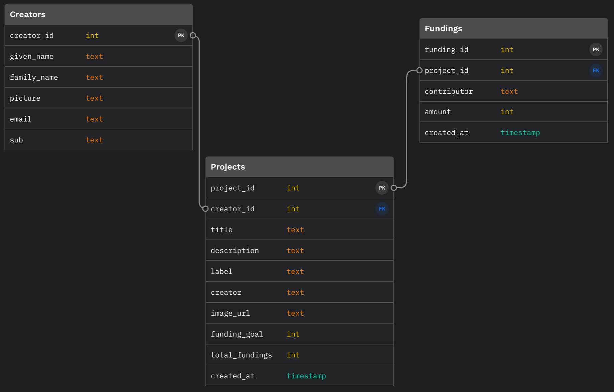

# <div align="center">  </div>

 <p align="center"><b>A kickstarter app that allows entreprenuers to promote business/product ideas and users to contribute to its initial seed funding</b></p>

## Contents

- [About](#about)
- [Live Demo](#live-demo)
- [Features](#features)
- [Technologies](#technologies)
- [Data Schema](#data-schema)
- [User Flow](#user-flow)
- [Future Features](#future-features)
- [Installation](#installation)

## About

[Live Demo on Heroku](https://jumpstart-app-xiao.herokuapp.com/) (**See next section for signing in with demo account**)

Are you interested in obtaining initial funding for your amazing business idea? Or are you an activist investor who wants to find the next "hot investment"? If either sounds like you, then **JumpStart** is THE APP for you to take advantage of crowdfunding.

## Live Demo

[Live Demo on Heroku](https://jumpstart-app-xiao.herokuapp.com/)

### Demo account (please sign in with Google)

- **Gmail**: jumpstart.tester001@gmail.com
- **Password**: Jumpstart123!

## Features

**GENERAL USER** acess:

- View product list page
  - Filter by project category


- View project details page 
  - Contribute to project initial seed funding by going through a simulated transaction powered by Stripe API
  - View funding history
  


**LOGGED-IN USER** access:

- Log in through Google account powered by Auth0


- Post new project ideas


- Edit and delete their own projects


## Technologies

JumpStart was built using:

- React (TypeScript)
- Node.js
- Express.js
- PostgreSQL

Third-party APIs and libraries:

- [Stripe API](https://stripe.com/docs/api)
- [Auth0](https://auth0.com/docs/get-started)
- [React Hook Form](https://react-hook-form.com/)

## Data Schema

<div align="center">  </div>

## User Flow


## Future Features


## Installation

### Prerequisites

**Docker**

This project relies on Docker to run the PostgreSQL server. You must install Docker first before continuing.

Use one of these methods:

- Use [Homebrew][] on macOS: `brew install --cask docker`
- [Follow the instructions on the Docker website][docker-www]

Once you've installed Docker Desktop, you'll need to launch the app. On macOS,
it's located in `/Applications/Docker`.

**Node**

You'll need to install Node v14 or above. [`nvm`][nvm] is highly recommended.

### Set Up the Development Environment

1. **Clone the repo:**
   ```sh
   git clone https://github.com/xiaozhong21/jumpstart.git
   ```
2. **Install all NPM packages using this in the root directory:**
   ```sh
   npm install
   ```
3. **Database setup:**

   1. Copy the root example environment file

   ```sh
   cp .env.example .env
   ```

   2. You can choose to edit `POSTGRES_DB` and `POSTGRES_PASSWORD` or just use as-is.
   
   3. Run the following to setup the database with the seed file:

   ```sh
   npm run db:init
   ```

   ℹ️ If you ever need to start over with the database, you can run this command
   again which will delete your existing data and start from scratch.

4. **Environment variables setup.** For full-feature site, you will need to set up `auth0` environment variables and API key for Stripe:

   1. Auth0 setup

      1. Connect Express server with Auth0: In the copied root `env` file, set up Auth0 domain and audience
         - These can be obtained by signing up for an Auth0 account and [Registering a Single-Page Web Application](https://auth0.com/docs/get-started) in order to get these values.
         - [Auth0's guide](https://auth0.com/blog/complete-guide-to-react-user-authentication/#Calling-an-API)
      2. Connect React with Auth0: Copy the app's example environment file and set up Auth0 domain + client-id

         ```sh
         cp app/.env.example app/.env
         ```

         - This [graphic](https://images.ctfassets.net/23aumh6u8s0i/1DyyZTcfbJHw577T6K2KZk/a8cabcec991c9ed33910a23836e53b76/auth0-application-settings) may be helpful to locating the values
         - [Auth0's guide](https://auth0.com/blog/complete-guide-to-react-user-authentication/#Connect-React-with-Auth0)

   2. Stripe API Key setup by signing up for an account on their [site](https://stripe.com/docs/keys)

### Start the Development Environment

```sh
npm start
```

Visit <http://localhost:3000>.

### Shut Down the Development Environment

1. `Ctrl-C` to stop the Express and React development servers.
1. `npm stop` to stop and destroy the PostgreSQL Docker container. Don't worry,
   your data is safe.

### Need to Start a `psql` Session?

```sh
npm run psql
```

[dh-postgres]: https://hub.docker.com/_/postgres
[docker-www]: https://docs.docker.com/get-docker/
[homebrew]: https://brew.sh
[nvm]: https://github.com/nvm-sh/nvm
