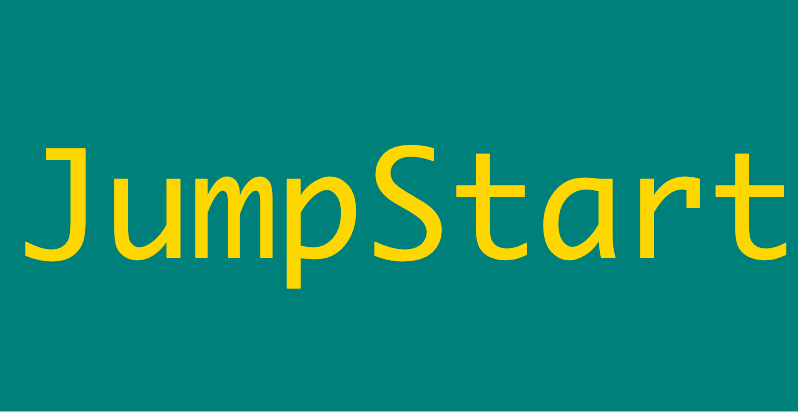

# JumpStart

# <div align="center">  </div>

 <p align="center"><b>A kickstarter app that allows entreprenuers to promote business/product ideas and users to contribute to its initial seed funding</b></p>

## Contents

- [About](#about)
- [Live Demo](#live-demo)
- [Architectual Overview](#architectual-overview)
- [UI Design](#ui-design)
- [Features Demo](#features-demo)
- [Technologies](#technologies)
- [Future Features](#future-features)
- [Installation](#installation)

## About

[Live Demo on Heroku](https://jumpstart-app-xiao.herokuapp.com/) (**See next section for signing in with demo account**)

Are you interested in obtaining initial funding for your amazing business idea? Or are you an activist investor who wants to find the next "hot investment"? If either sounds like you, then **JumpStart** is THE APP for you to take advantage of crowdfunding.

#### General user features:

- View project list page
- View project details page where they can
  - Contribute to project initial funding
  - View funding history

#### Authorized/Logged-in user features (on top of getting all above):

- Log in
- Post new projects
- Edit created projects
- Delete created projects

## Live Demo

[Live Demo on Heroku](https://jumpstart-app-xiao.herokuapp.com/)

### Demo account (please sign in with Google)

- **Gmail**: jumpstart.tester001@gmail.com
- **Password**: Jumpstart123!

## Architectual Overview
### Structure and MVC pattern
- Note that both front- and back-end design follow the MVC (Model-View-Controller) pattern to achieve better scalability and maintainability

```
.
├── app
│   ├── src
│   │   ├── assets
│   │   │   ├── logo.png
│   │   │   └── ...
│   │   │
│   │   ├── components
│   │   │   ├── Footer.tsx
│   │   │   ├── FundingHistoryModal.tsx
│   │   │   ├── Nav.tsx
│   │   │   ├── ProgressBar.tsx
│   │   │   ├── ProjectCard.tsx
│   │   │   └── TopTabs.tsx
│   │   │
│   │   ├── pages
│   │   │   ├── Dashboard
│   │   │   │   ├── DashboardController.tsx
│   │   │   │   └── DashboardView.tsx
│   │   │   ├── FundingForm
│   │   │   │   ├── FundingFormController.tsx
│   │   │   │   └── FundingFormView.tsx
│   │   │   ├── ProjectDetails
│   │   │   │   ├── ProjectDetailsController.tsx
│   │   │   │   └── ProjectDetailsView.tsx
│   │   │   ├── ProjectForm
│   │   │   │   ├── ProjectFormController.tsx
│   │   │   │   └── ProjectFormView.tsx
│   │   │   └── ProjectList
│   │   │       ├── ProjectListController.tsx
│   │   │       └── ProjectListView.tsx
│   │   │
│   │   ├── services
│   │   │   ├── apiClients
│   │   │   │   ├── useProtectedApi.ts
│   │   │   │   └── usePublicApi.ts
│   │   │   └── auth
│   │   ├── utils
│   │   ├── App.tsx
│   │   ├── index.tsx
│   │   └── ...
│   │
│   ├── .env
│   ├── package.json
│   ├── tsconfig.json
│   └── ...
│
├── server
│   ├── src
│   │   ├── controller
│   │   │   ├── creatorRouter.ts
│   │   │   ├── paymentRouter.ts
│   │   │   └── projectRouter.ts
│   │   ├── model
│   │   │   ├── creator.model.ts
│   │   │   ├── funding.model.ts
│   │   │   └── project.model.ts
│   │   ├── services
│   │   │   ├── dbConnection.ts
│   │   │   └── jwtCheck.ts
│   │   ├── utils
│   │   └── server.ts
│   │
│   ├── package.json
│   └── tsconfig.json
│
├── .env
├── package.json
├── README.md
└── ...

```
### Data Schema

A snapshot of seed data can be found in `./pg/seed.psql`, which includes data tables and their relationships.

<div align="center">  </div>

### Expected payload and response
Example payload sent by submitting the project form to create a new project:
a `POST` request to the `/api/creators/projects` endpoint

```
{
  title: "Cat Caffe Featuring Clawdia Miawwww",
  description: "Hi my JumpStart friends! Clawdia and I have recently started our cat cafe business and   would like your help expanding and scaling it to more cities. Come and fund this project and Clawdia will be your best friend forever!\n",
  fundingGoal: "5000",
  imageUrl: "https://images.unsplash.com/photo-1519052537078-e6302a4968d4?ixlib=rb-1.2.1&ixid=MnwxMjA3fDB8MHxwaG90by1wYWdlfHx8fGVufDB8fHx8&auto=format&fit=crop&w=2670&q=80",
  label: "Food and Craft"
}
```

Example response received:
- Note that the `total_fundings` is set to 0 upon initial project creation and is calculated every time a new funding comes in
- `project_id` and `created_at` are automatically created upon form submission, and `creator_id` is attached to the logged-in user

```
{
  "project_id":10,
  "creator_id":2,
  "title":"Cat Caffe Featuring Clawdia Miawwww",
  "description":"Hi my JumpStart friends! Clawdia and I have recently started our cat cafe business and would like your help expanding and scaling it to more cities. Come and fund this project and Clawdia will be your best friend forever!\n","label":"Food and Craft","image_url":"https://images.unsplash.com/photo-1519052537078-e6302a4968d4?ixlib=rb-1.2.1&ixid=MnwxMjA3fDB8MHxwaG90by1wYWdlfHx8fGVufDB8fHx8&auto=format&fit=crop&w=2670&q=80",
  "funding_goal":5000,
  "total_fundings":0,
  "created_at":"2022-03-20T22:12:33.586Z"
}
```

## UI Design
### Reusable components
This project uses multiple reusable components that can be found in the `./app/src/components` folder, for example
- `ProjectCard` component is used in both `ProjectList` page and `Dashboard` page to reuse the design of individual project card
- `ProgressBar` component is used in both `ProjectCard` component and `ProductDetails` page

### Accessibility
- Screen reader friendly site achieved with
  - Semantic HTML tags: semantic tags are used when necessary to provide high-level meaning to the HTML structure. For example, in the `App.tsx` master component, `<header>` `<main>` `<footer>` are used to indicate the purpose of their respective contents

  - Aria labels and descriptions: these are added to all interactive elements to help screen reader users interact with the app
 
- Responsive site: the site is mobile- and tablet-responsive to achieve greater access to the site using different devices


### Material-UI components
This project uses various MUI components. A non-exhaustive list: `Box`, `Button`, `Typography`, `Modal`, `List`, `ListItem`, `Avatar`, `AppBar`, `Container`, `Menu`, `LinearProgress`, `Input`, `Card`, etc.

## Features Demo
**General users** can:
- View project list page
- View project details page where they can
 -  Contribute to project initial funding
 -  View funding history
 
**Authorized/Logged-in users** can do the following on top of getting general user access:
- Log in
- Post new projects
- Edit created projects
- Delete created projected

### GENERAL USER demo

### View project list page
- Filter by project category


### View project details page
- Contribute to project initial seed funding by going through a simulated transaction powered by Stripe API
  - Funding form has basic validation to handle payment errors
- View funding history
  


### LOGGED-IN USER demo

### Log in through Google account powered by Auth0


### Post new project ideas


### Edit and delete their own projects


## Technologies

JumpStart was built using:

- React (TypeScript)
- Node.js
- Express.js
- PostgreSQL

Third-party APIs and libraries:

- [Stripe API](https://stripe.com/docs/api)
- [Auth0](https://auth0.com/docs/get-started)
- [React Hook Form](https://react-hook-form.com/)


## Future Features
- Enable comments on projects by contributors
- Allow user to upload image (via local file rather than pasting a URL) when creating new project
- Add more project categories and allow user-defined categories
- Update user dashboard to include Stripe account management, money transfer, etc.

## Installation

### Prerequisites

**Docker**

This project relies on Docker to run the PostgreSQL server. You must install Docker first before continuing.

Use one of these methods:

- Use [Homebrew][] on macOS: `brew install --cask docker`
- [Follow the instructions on the Docker website][docker-www]

Once you've installed Docker Desktop, you'll need to launch the app. On macOS,
it's located in `/Applications/Docker`.

**Node**

You'll need to install Node v14 or above. [`nvm`][nvm] is highly recommended.

### Set Up the Development Environment

1. **Clone the repo:**
   ```sh
   git clone https://github.com/xiaozhong21/jumpstart.git
   ```
2. **Install all NPM packages using this in the root directory:**
   ```sh
   npm install
   ```
3. **Database setup:**

   1. Copy the root example environment file

   ```sh
   cp .env.example .env
   ```

   2. You can choose to edit `POSTGRES_DB` and `POSTGRES_PASSWORD` or just use as-is.
   
   3. Run the following to setup the database with the seed file:

   ```sh
   npm run db:init
   ```

   ℹ️ If you ever need to start over with the database, you can run this command
   again which will delete your existing data and start from scratch.

4. **Environment variables setup.** For full-feature site, you will need to set up `auth0` environment variables and API key for Stripe:

   1. Auth0 setup

      1. Connect Express server with Auth0: In the copied root `env` file, set up Auth0 domain and audience
         - These can be obtained by signing up for an Auth0 account and [Registering a Single-Page Web Application](https://auth0.com/docs/get-started) in order to get these values.
         - [Auth0's guide](https://auth0.com/blog/complete-guide-to-react-user-authentication/#Calling-an-API)
      2. Connect React with Auth0: Copy the app's example environment file and set up Auth0 domain + client-id

         ```sh
         cp app/.env.example app/.env
         ```

         - This [graphic](https://images.ctfassets.net/23aumh6u8s0i/1DyyZTcfbJHw577T6K2KZk/a8cabcec991c9ed33910a23836e53b76/auth0-application-settings) may be helpful to locating the values
         - [Auth0's guide](https://auth0.com/blog/complete-guide-to-react-user-authentication/#Connect-React-with-Auth0)


   2. Stripe API Key setup by signing up for an account on their [site](https://stripe.com/docs/keys)

   - The secret key will be put in `.env` as `STRIPE_API_SECRET_KEY`
   - The publshable key will be put in `./app/.env` as `REACT_APP_STRIPE_KEY`

### Start the Development Environment

```sh
npm start
```

Visit <http://localhost:3000>.

### Shut Down the Development Environment

1. `Ctrl-C` to stop the Express and React development servers.
1. `npm stop` to stop and destroy the PostgreSQL Docker container. Don't worry,
   your data is safe.

### Need to Start a `psql` Session?

```sh
npm run psql
```

[dh-postgres]: https://hub.docker.com/_/postgres
[docker-www]: https://docs.docker.com/get-docker/
[homebrew]: https://brew.sh
[nvm]: https://github.com/nvm-sh/nvm
